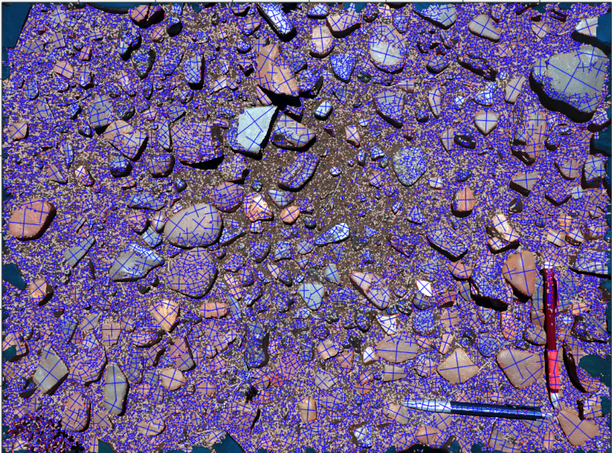

#  Chamantha Athapaththu

- I am an environment scientist with a special interest in land and water management. Have strong technical skills in spatial analysis and lot of experience with GIS.
- I am also into coding, especially python scripting for ArcGIS and QGIS workflows and also javascript in Google Earth Engine (GEE).
- Happy to share and also learn from others. 😊

## Skills and Experience
- 🌱 Environment science
- 🌍 GIS, Remote sensing
- 💻 Python, R, javascript (GEE)

## YouTube Channel (BrighTec)
- I also do GIS tutorials on YouTube. Click below to check my YouTube channel.
 https://www.youtube.com/@brightec703)
